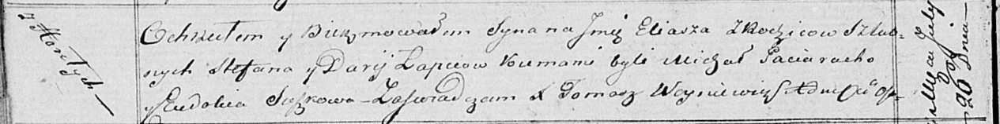

**Лапец Илья Стефанов (Lapiec Eliasz)**

26 июля 1819 г -- крещение сына Ильи (НИАБ 136-13-894, лист 101об,
№39/1819-р (ориг)).

**НИАБ 136-13-894:** Лист 101об. **Метрическая запись №39/1819-р
(ориг).**

Осовская Покровская церковь. 26 июля 1819 года. Метрическая запись о
крещении.

Łapieć Eliasz -- сын родителей с деревни Горелое.

Łapieć Stefan -- отец.

Łapciowa Darija -- мать.

Paciarucho Michał -- кум.

Suszkowa Eudokia -- кума.

Woyniewicz Tomasz -- ксёндз.
