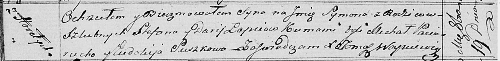

**Лапец Руза Стефанова (Lapciowna Róza)**

15 августа 1821 г -- крещение (НИАБ 136-13-894, лист 107, №38/1821-р
(ориг)).

**НИАБ 136-13-894:** Лист 107. **Метрическая запись №38/1821-р (ориг).**

{width="6.496527777777778in"
height="1.0768318022747156in"}

Осовская Покровская церковь. 15 августа 1821 года. Метрическая запись о
крещении.

Łapciowna Róza -- дочь родителей с деревни Горелое.

Łapiec Stefan -- отец.

Łapciowa Darija -- мать.

Pociurucha Michałko -- кум.

Suszkowa Ewdokija -- кума.

Woyniewicz Tomasz -- ксёндз.
