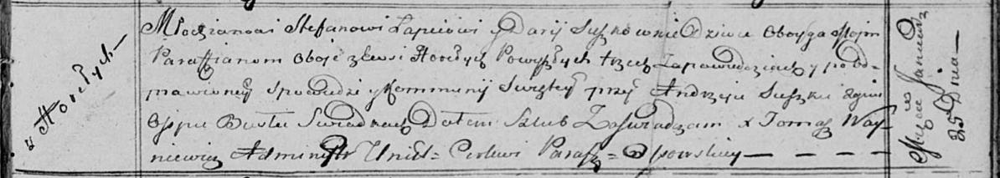
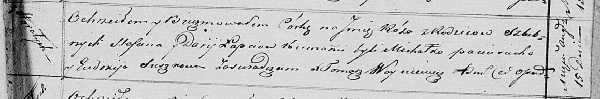

**Лапец Стефан (Lapiec Stefan)**

25 января 1814 г -- венчание с девкой Дарьей Сушко с деревни Горелое
(НИАБ 136-13-920, лист 21, №2/1814-б (ориг)).

21? августа 1815 г -- крещение сына Лукаша (НИАБ 136-13-894, лист 92об,
№34/1815-р (ориг)).

19 октября 1817 г -- крещение сына Сымона (НИАБ 136-13-894, лист 97об,
№62/1817-р (ориг)).

26 июля 1819 г -- крещение сына Ильи (НИАБ 136-13-894, лист 101об,
№39/1819-р (ориг)).

15 августа 1821 г -- крещение дочери Рузы (НИАБ 136-13-894, лист 107,
№38/1821-р (ориг)).

**НИАБ 136-13-920:** Лист 21. **Метрическая запись №2/1814-б (ориг).**

Осовская Покровская церковь. 25 января 1814 года. Запись о венчании.

Łapać Stefan -- жених, молодой, парафии Осовской, с деревни Горелое.

Suszkowna Darija -- невеста, девка, парафии Осовской, с деревни Горелое.

Suszko Andrzej -- свидетель.

Busła Osip -- свидетель.

Woyniewicz Tomasz -- ксёндз.

**НИАБ 136-13-894:** Лист 92об. **Метрическая запись №34/1815-р
(ориг).**

Осовская Покровская церковь. \[21\] августа 1815 года. Метрическая
запись о крещении.

Łapieć Łukasz -- сын родителей с деревни Горелое.

Łapieć Stefan -- отец.

Łapciowa Darija -- мать.

Paciarucha Michał -- кум.

Suszkowa Eudokia -- кума.

Woyniewicz Tomasz -- ксёндз.

**НИАБ 136-13-894:** Лист 97об. **Метрическая запись №62/1817-р
(ориг).**

Осовская Покровская церковь. 19 октября 1817 года. Метрическая запись о
крещении.

Łapiec Symon -- сын родителей с деревни Горелое.

Łapiec Stefan -- отец.

Łapciowa Darija -- мать.

Paciarucha Michał -- кум.

Suszkowa Eudokija -- кума.

Woyniewicz Tomasz -- ксёндз.

**НИАБ 136-13-894:** Лист 101об. **Метрическая запись №39/1819-р
(ориг).**

Осовская Покровская церковь. 26 июля 1819 года. Метрическая запись о
крещении.

Łapieć Eliasz -- сын родителей с деревни Горелое.

Łapieć Stefan -- отец.

Łapciowa Darija -- мать.

Paciarucho Michał -- кум.

Suszkowa Eudokia -- кума.

Woyniewicz Tomasz -- ксёндз.

**НИАБ 136-13-894:** Лист 107. **Метрическая запись №38/1821-р (ориг).**

Осовская Покровская церковь. 15 августа 1821 года. Метрическая запись о
крещении.

Łapciowna Róza -- дочь родителей с деревни Горелое.

Łapiec Stefan -- отец.

Łapciowa Darija -- мать.

Pociurucha Michałko -- кум.

Suszkowa Ewdokija -- кума.

Woyniewicz Tomasz -- ксёндз.
