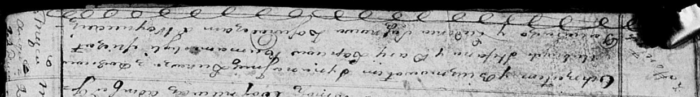
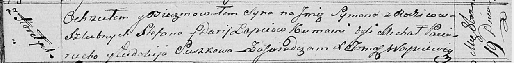

**Лапец Сымон Стефанов (Lapiec Symon)**

19 октября 1817 г -- крещение (НИАБ 136-13-894, лист 97об, №62/1817-р
(ориг)).

**НИАБ 136-13-894:** Лист 92об. **Метрическая запись №34/1815-р
(ориг).**

Осовская Покровская церковь. \[21\] августа 1815 года. Метрическая
запись о крещении.

Łapieć Łukasz -- сын родителей с деревни Горелое.

Łapieć Stefan -- отец.

Łapciowa Darija -- мать.

Paciarucha Michał -- кум.

Suszkowa Eudokia -- кума.

Woyniewicz Tomasz -- ксёндз.

**НИАБ 136-13-894:** Лист 97об. **Метрическая запись №62/1817-р
(ориг).**

Осовская Покровская церковь. 19 октября 1817 года. Метрическая запись о
крещении.

Łapiec Symon -- сын родителей с деревни Горелое.

Łapiec Stefan -- отец.

Łapciowa Darija -- мать.

Paciarucha Michał -- кум.

Suszkowa Eudokija -- кума.

Woyniewicz Tomasz -- ксёндз.
