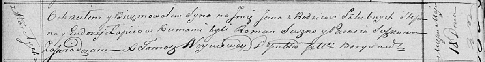

**Лапец Стефан (Lapiec Stefan)**

18 мая 1819 г -- крещение сына Яна (НИАБ 136-13-894, лист 101,
№25/1819-р (ориг)).

**НИАБ 136-13-894:** Лист 101. **Метрическая запись №25/1819-р (ориг).**

Осовская Покровская церковь. 18 мая 1819 года. Метрическая запись о
крещении.

Łapieć Jan -- сын родителей с деревни Горелое.

Łapieć Stefan -- отец.

Łapciowa Eudokija -- мать.

Suszko Roman -- кум.

Suszkowa Parasia -- кума.

Woyniewicz Tomasz -- ксёндз.
