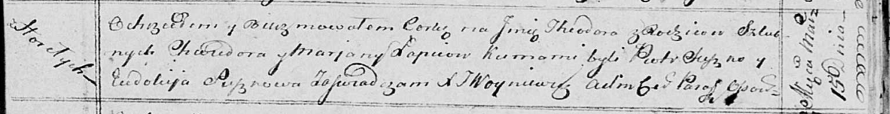

**Лапец Тодора Хведорова (Lapciowna Theodora)**

15 марта 1814 г -- крещение (НИАБ 136-13-894, лист 89, №15/1814-р
(ориг)).

**НИАБ 136-13-894:** Лист 89. **Метрическая запись №15/1814-р (ориг).**

{width="6.496527777777778in"
height="0.8388024934383203in"}

Осовская Покровская церковь. 15 марта 1814 года. Метрическая запись о
крещении.

Łapciowna Theodora -- дочь родителей с деревни Горелое.

Łapieć Chwiedor -- отец.

Łapciowa Marjana -- мать.

Suszko Piotr -- кум.

Suszkowa Eudokija -- кума.

Woyniewicz Tomasz -- ксёндз.
