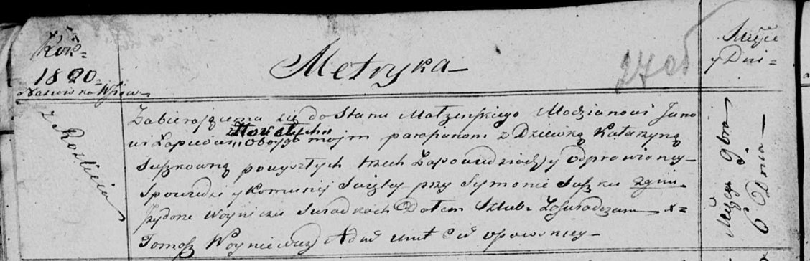

**Лапец (в девичестве Сушко) Катарына (Łapciowa Katarzyna z Suszkow)**

6 ноября 1820 г -- венчание с молодым Яном Лапецом с деревни Горелое
(НИАБ 136-13-920, лист 27об, №8/1820-б (ориг)).

**НИАБ 136-13-920:** Лист 27об. **Метрическая запись №8/1820-б (ориг).**

{width="6.496527777777778in"
height="2.09667104111986in"}

Осовская Покровская церковь. 6 ноября 1820 года. Запись о венчании.

Łapac Jan -- жених, молодой, парафии Осовской, с деревни Горелое.

Suszkowna Katarzyna -- невеста, девка, парафии Осовской, с деревни
Разлитье.

Suszko Symon -- свидетель.

Woynicz Jzydor -- свидетель.

Woyniewicz Tomasz -- ксёндз.
