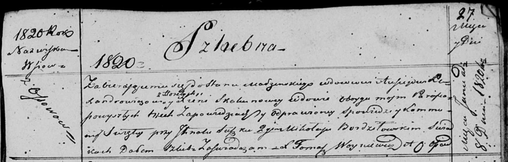

**Лександрович (в предыдущем браке Скакун) Ксеня (Lexandrowiczowa
(Skakunowa) Xienia)**

8 января 1820 г -- венчание с вдовцом Авсеем Лександровичем с деревни
Горелое (НИАБ 136-13-920, лист 27, №1/1820-б (ориг)).

**НИАБ 136-13-920:** Лист 27. **Метрическая запись №1/1820-б (ориг).**

{width="6.496527777777778in"
height="2.083931539807524in"}

Осовская Покровская церковь. 8 января 1820 года. Запись о венчании.

Lexandrowicz Ausiej -- жених, вдовец, парафии Осовской, с деревни
Горелое.

Skakunowa Xienia -- невеста, вдова, парафии Осовской, с деревни Осово.

Suszko Jhnat -- свидетель.

Bordziłowski Mikołay -- свидетель.

Woyniewicz Tomasz -- ксёндз.
