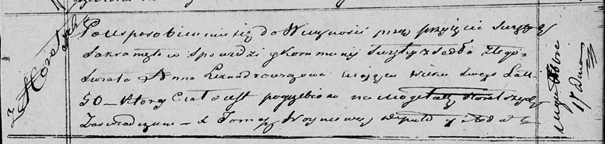

**Лександрович, Александрович (Сушко) Анна (Lexandrowiczowa,
Alexandrowiczowa Anna z Suszkow)**

20 февраля 1810 г -- венчание с Пахомом Александровичем с деревни
Горелое (НИАБ 136-13-920, лист 16, №1/1810-б (ориг)).

1 октября 1814 г -- крещение сына Каликста (НИАБ 136-13-894, лист 90об,
№55/1814-р (ориг)).

17 декабря 1819 г -- отпевание, умерла в возрасте 50 лет (родилась около
1769 г) (НИАБ 136-13-919, лист 33, №9/1819-у (ориг)).

**НИАБ 136-13-920:** Лист 16. **Метрическая запись №1/1810-б (ориг).**

{width="6.496527777777778in"
height="1.3584437882764655in"}

Дедиловичская Покровская церковь. 20 февраля 1810 года. Метрическая
запись о венчании.

Alexandrowicz Pachom -- жених, с деревни Горелое.

Suszkowna Anna -- невеста, с деревни Горелое.

Alexandrowicz Ausiey -- свидетель.

Suszko Taras -- свидетель.

Jazgunowicz Antoni -- ксёндз.

**НИАБ 136-13-894:** Лист 90об. **Метрическая запись №55/1814-р
(ориг).**

{width="6.496527777777778in"
height="0.7777865266841645in"}

Осовская Покровская церковь. 1 октября 1814 года. Метрическая запись о
крещении.

Lexandrowicz Kalixt -- сын родителей с деревни Горелое.

Lexandrowicz Pachom -- отец.

Lexandrowiczowa Anna -- мать.

Babouka Kondrat -- кум.

Suszkowa Polonia -- кума.

Woyniewicz Tomasz -- ксёндз.

**НИАБ 136-13-919:** Лист 33. **Метрическая запись №9/1819-у (ориг).**

{width="6.496527777777778in"
height="1.55625in"}

Осовская униатская церковь. 17 декабря 1819 года. Метрическая запись об
отпевании.

Lexandrowiczowa Anna -- умершая, 50 лет, с деревни Горелое, похоронена
на кладбище деревни Горелое.

Woyniewicz Tomasz -- ксёндз.
