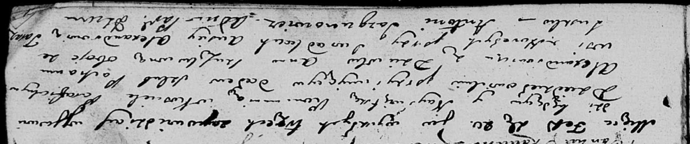
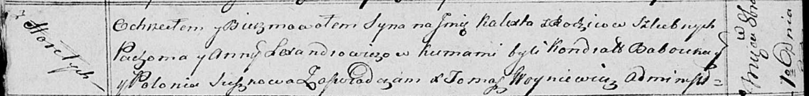

**Лександрович Пахом (Lexandrowicz, Alexandrowicz Pachom)**

20 февраля 1810 г -- венчание с Анной Сушко с деревни Горелое (НИАБ
136-13-920, лист 16, №1/1810-б (ориг)).

1 октября 1814 г -- крещение сына Каликста (НИАБ 136-13-894, лист 90об,
№55/1814-р (ориг)).

**НИАБ 136-13-920:** Лист 16. **Метрическая запись №1/1810-б (ориг).**

Дедиловичская Покровская церковь. 20 февраля 1810 года. Метрическая
запись о венчании.

Alexandrowicz Pachom -- жених, с деревни Горелое.

Suszkowna Anna -- невеста, с деревни Горелое.

Alexandrowicz Ausiey -- свидетель.

Suszko Taras -- свидетель.

Jazgunowicz Antoni -- ксёндз.

**НИАБ 136-13-894:** Лист 90об. **Метрическая запись №55/1814-р
(ориг).**

Осовская Покровская церковь. 1 октября 1814 года. Метрическая запись о
крещении.

Lexandrowicz Kalixt -- сын родителей с деревни Горелое.

Lexandrowicz Pachom -- отец.

Lexandrowiczowa Anna -- мать.

Babouka Kondrat -- кум.

Suszkowa Polonia -- кума.

Woyniewicz Tomasz -- ксёндз.
