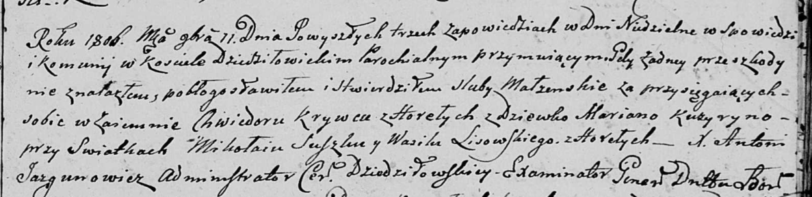

**Лисичёнок, Лисовский Василь (Lisowski Wasil)**

11 ноября 1806 г -- свидетель венчания Хведора Крывца с деревни Горелое
с девкой Марьяной Кузуро (НИАБ 136-13-920, лист 12, №3/1806-б (ориг)).

**НИАБ 136-13-920:** Лист 12. **Метрическая запись №3/1806-б (ориг).**

{width="6.496527777777778in"
height="1.5817224409448818in"}

Дедиловичская Покровская церковь. 11 ноября 1806 года. Метрическая
запись о венчании.

Krywiec Chwiedor -- жених, с деревни Горелое.

Kuzyryna Marjana -- невеста, девка.

Suszko Mikołay -- свидетель.

Lisowski Wasil -- свидетель, с деревни Горелое.

Jazgunowicz Antoni -- ксёндз.
