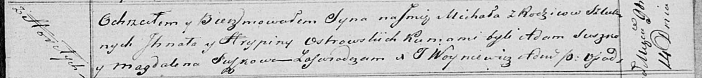

**Островский Михал Игнатов (Ostrowski Michał)**

14 ноября 1820 г -- крещение (НИАБ 136-13-894, лист 105, №38/1820-р
(ориг)).

Лист 105. **Метрическая запись №38/1820-р (ориг).**

Осовская Покровская церковь. 14 ноября 1820 года. Метрическая запись о
крещении.

Ostrowski Michał -- сын родителей с деревни Горелое.

Ostrowski Jhnat -- отец.

Ostrowska Hrypina -- мать.

Suszko Adam -- кум.

Suszkowa Magdalena -- кума.

Woyniewicz Tomasz -- ксёндз.
