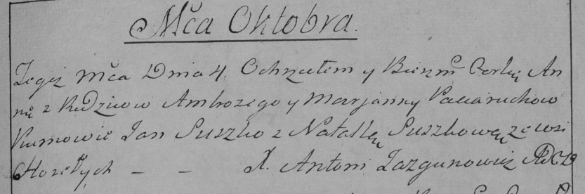

**Потеруха Анна Амброзьева (Paciaruchowna Anna)**

4 октября 1787 г -- крещение (НИАБ 136-13-894, лист 3, №53/1787-р
(ориг)), (РГИА 823-2-18, лист 234об, №28/1787-р (коп)).

**НИАБ 136-13-894:** Лист 3. **Метрическая запись №53/1787-р (ориг).**

{width="6.496527777777778in"
height="1.0567169728783903in"}

Дедиловичская Покровская церковь. 4 октября 1787 года. Метрическая
запись о крещении.

Paciaruchowna Anna -- дочь родителей с деревни Горелое.

Paciarucha Ambroźij -- отец.

Paciaruchowa Marjana -- мать.

Suszko Jan - кум.

Suszkowa Natalla - кума.

Jazgunowicz Antoni -- ксёндз.

**РГИА 823-2-18:** Лист 235. **Метрическая запись №28/1787-р (коп).**

{width="6.496527777777778in"
height="2.1527777777777777in"}

Дедиловичская Покровская церковь. 4 октября 1787 года. Метрическая
запись о крещении.

Paciaruchowna Anna -- дочь родителей с деревни Горелое.

Paciarucha Ambrozy -- отец.

Paciaruchowa Marjanna -- мать.

Suszko Jan -- кум.

Suszkowa Natalla - кума.

Jazgunowicz Antoni -- ксёндз.
