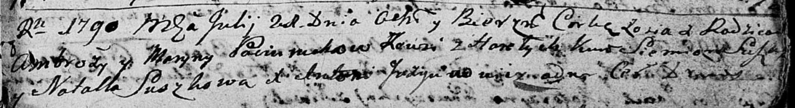

**Потеруха Марьяна (Paciaruchowa Marjana, Maryna)**

4 октября 1787 г -- крещение дочери Анны (НИАБ 136-13-894, лист 3,
№53/1787-р (ориг)), (РГИА 823-2-18, лист 234об, №28/1787-р (коп)).

21 июля 1790 г -- крещение дочери Зоси (НИАБ 136-13-894, лист 10,
№45/1790-р (ориг)).

1 января 1793 г -- крещение дочери Настасья (НИАБ 136-13-894, лист 18,
№1/1793-р (ориг)), (РГИА 823-2-18, лист 246, №2/1793-р (коп)).

9 ноября 1799 г -- крестная мать Катерыны, дочери Сушков Грыгора и
Настасьи с деревни Горелое (НИАБ 136-13-894, лист 40, №47/1799-р (ориг),
НИАБ 136-13-938, лист 245, №43/1799-р (коп)).

**НИАБ 136-13-894:** Лист 3. **Метрическая запись №53/1787-р (ориг).**

{width="6.496527777777778in"
height="1.0567169728783903in"}

Дедиловичская Покровская церковь. 4 октября 1787 года. Метрическая
запись о крещении.

Paciaruchowna Anna -- дочь родителей с деревни Горелое.

Paciarucha Ambroźij -- отец.

Paciaruchowa Marjana -- мать.

Suszko Jan - кум.

Suszkowa Natalla - кума.

Jazgunowicz Antoni -- ксёндз.

**РГИА 823-2-18:** Лист 235. **Метрическая запись №28/1787-р (коп).**

{width="6.496527777777778in"
height="2.1527777777777777in"}

Дедиловичская Покровская церковь. 4 октября 1787 года. Метрическая
запись о крещении.

Paciaruchowna Anna -- дочь родителей с деревни Горелое.

Paciarucha Ambrozy -- отец.

Paciaruchowa Marjanna -- мать.

Suszko Jan -- кум.

Suszkowa Natalla - кума.

Jazgunowicz Antoni -- ксёндз.

**НИАБ 136-13-894:** Лист 10. **Метрическая запись №45/1790-р (ориг).**

{width="6.496527777777778in"
height="0.8951246719160105in"}

Дедиловичская Покровская церковь. 21 июля 1790 года. Метрическая запись
о крещении.

Paciaruchowna Zosia -- дочь родителей с деревни Горелое.

Paciarucha Ambrozy -- отец.

Paciaruchowa Maryna -- мать.

Suszko Siemien - кум.

Suszkowa Natalla - кума.

Jazgunowicz Antoni -- ксёндз.

**НИАБ 136-13-894:** Лист 18. **Метрическая запись №1/1793-р (ориг).**

{width="6.496527777777778in"
height="0.8072889326334208in"}

Дедиловичская Покровская церковь. 1 января 1793 года. Метрическая запись
о крещении.

Paciaruchowna Nastazya -- дочь родителей с деревни Горелое.

Paciarucha Ambrozy -- отец.

Paciaruchowa Maryna -- мать.

Suszko Janka - кум.

Suszkowa Natalla - кума.

Jazgunowicz Antoni -- ксёндз.

**РГИА 823-2-18:** Лист 246. **Метрическая запись №1/1793-р (коп).**

{width="6.496527777777778in"
height="2.2625in"}

Дедиловичская Покровская церковь. 1 января 1793 года. Метрическая запись
о крещении.

Paciaruchowna Nastazya -- дочь родителей с деревни Горелое.

Paciarucha Ambrozy -- отец.

Paciaruchowa Maryna -- мать.

Suszko Janka -- кум.

Suszkowa Natalla -- кума.

Jazgunowicz Antoni -- ксёндз.

**НИАБ 136-13-894:** Лист 40. **Метрическая запись №47/1799-р (ориг).**

{width="6.496527777777778in"
height="0.8072889326334208in"}

Дедиловичская Покровская церковь. 9 ноября 1799 года. Метрическая запись
о крещении.

Suszkowna Katerzyna -- дочь родителей с деревни Горелое.

Suszko Hryhor -- отец.

Suszkowa Nastazyja -- мать.

Bobowka Kondrat -- кум, с деревни Пядынь.

Paciaruchowa Marjana -- кума, с деревни Горелое.

Jazgunowicz Antoni -- ксёндз.

**НИАБ 136-13-938:** Лист 245. **Метрическая запись №43/1799-р (коп).**

(См. тж. НИАБ 136-13-894, лист 40, №47/1799-р (ориг); РГИА 823-2-18,
лист 273, №46/1799-р (коп))

{width="6.496527777777778in"
height="1.49375in"}

Дедиловичская Покровская церковь. 6 ноября 1799 года. Метрическая запись
о крещении.

Suszkowna Tekla \[Katerzyna\] Anna -- дочь родителей с деревни Горелое.

Suszko Hryhor -- отец.

Suszkowa Nastazya -- мать.

Bobowka Kondrat -- кум, с деревни Горелое \[Пядань\].

Paciaruchowa Marya - кума,с деревни Горелое.

Jazgunowicz Antoni -- ксёндз.
