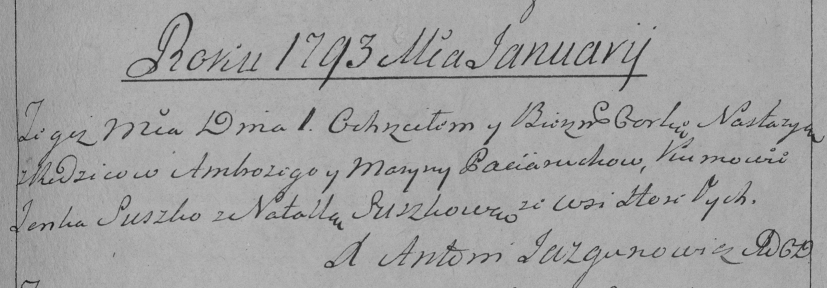

**Потеруха Настасья Амброзьева (Paciaruchowna Nastazya)**

1 января 1793 г -- крещение (НИАБ 136-13-894, лист 18, №1/1793-р
(ориг)), (РГИА 823-2-18, лист 246, №2/1793-р (коп)).

Лист 18. **Метрическая запись №1/1793-р (ориг).**

{width="6.496527777777778in"
height="0.8072889326334208in"}

Дедиловичская Покровская церковь. 1 января 1793 года. Метрическая запись
о крещении.

Paciaruchowna Nastazya -- дочь родителей с деревни Горелое.

Paciarucha Ambrozy -- отец.

Paciaruchowa Maryna -- мать.

Suszko Janka - кум.

Suszkowa Natalla - кума.

Jazgunowicz Antoni -- ксёндз.

**РГИА 823-2-18:** Лист 246. **Метрическая запись №1/1793-р (коп).**

{width="6.496527777777778in"
height="2.2625in"}

Дедиловичская Покровская церковь. 1 января 1793 года. Метрическая запись
о крещении.

Paciaruchowna Nastazya -- дочь родителей с деревни Горелое.

Paciarucha Ambrozy -- отец.

Paciaruchowa Maryna -- мать.

Suszko Janka -- кум.

Suszkowa Natalla -- кума.

Jazgunowicz Antoni -- ксёндз.
