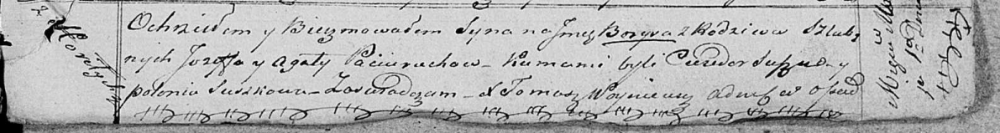

**Потеруха Борыс Иосифов (Paciarucha Borys)**

1 мая 1821 г -- крещение (НИАБ 136-13-894, лист 106, №22/1821-р (ориг)).

**НИАБ 136-13-894:** Лист 106. **Метрическая запись №22/1821-р (ориг).**

Осовская Покровская церковь. 1 мая 1821 года. Метрическая запись о
крещении.

Paciarucha Borys -- дочь родителей с деревни Горелое.

Paciarucha Jozef -- отец.

Paciaruchowa Agata -- мать.

Suszko Chwiedor -- кум.

Suszkowa Połonia -- кума.

Woyniewicz Tomasz -- ксёндз.
