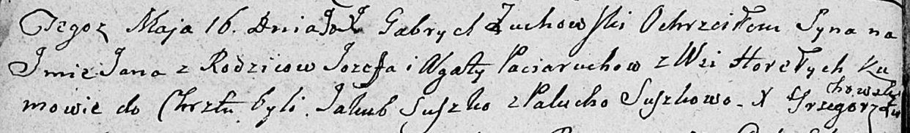

**Потеруха Елена Иосифова (Pocieruchowna Elena)**

30 июля 1811 г -- крещение дочери Елены (НИАБ 136-13-894, лист 81об,
№38/1811-р (ориг)).

**НИАБ 136-13-894:** Лист 81об. **Метрическая запись №38/1811-р
(ориг).**

{width="6.496527777777778in"
height="0.9346850393700787in"}

Осовская Покровская церковь. 30 июля 1811 года. Метрическая запись о
крещении.

Poceruchowna Elena -- дочь родителей с деревни Горелое.

Pocierucha Jozef -- отец.

Pocieruchowa Agata -- мать.

Szuszko Chwiedor -- кум.

Szuszkowa Polonia -- кума.

Woyniewicz Tomasz -- ксёндз.
