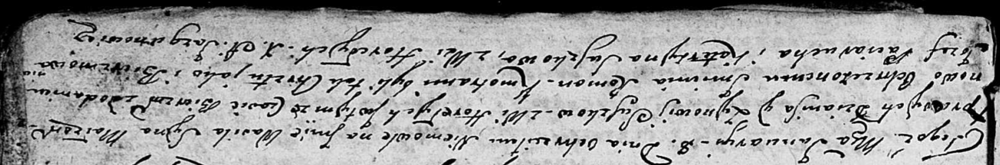
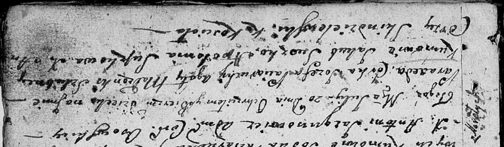
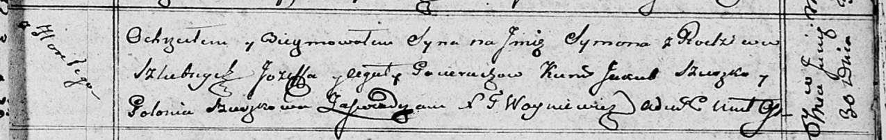
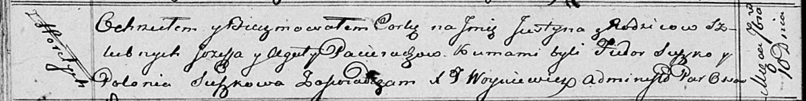
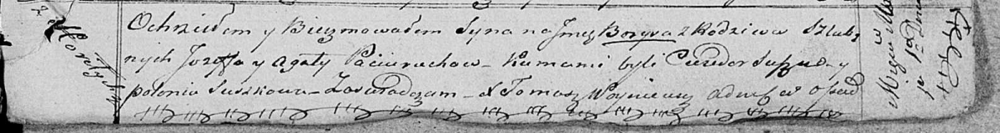
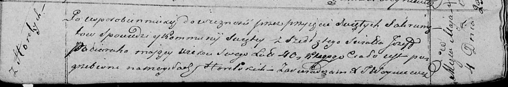

**Потеруха Иосиф (Paciarucha, Pocierucha Jozef)**

14 февраля 1804 г -- венчание с девкой Агатой Лапец (НИАБ 136-13-920,
лист 10, №3/1804-б (ориг)).

8 января 1805 г -- крестный отец Василя Романа, сына Сушков Дениса и
Зыновии с деревни Горелое (НИАБ 136-13-894, лист 55об, №57/1805-р
(ориг)).

10 апреля 1805 г -- крещение сына Базиля Игнацыя (НИАБ 136-13-894, лист
57, №20/1805-р (ориг)).

20 июля 1807 г -- крещение дочери Паракседы (НИАБ 136-13-894, лист 63,
№36/1807-р (ориг)).

16 мая 1809 г -- крещение сына Яна (НИАБ 136-13-894, лист 74об,
№23/1809-р (ориг)).

30 июня 1810 г -- крещение сына Сымона (НИАБ 136-13-894, лист 78,
№26/1810-р (ориг)).

30 июля 1811 г -- крещение дочери Елены (НИАБ 136-13-894, лист 81об,
№38/1811-р (ориг)).

10 сентября 1816 г -- крещение дочери Юстыны (НИАБ 136-13-894, лист
94об, №32/1816-р (ориг)).

1 мая 1821 г -- крещение сына Борыса (НИАБ 136-13-894, лист 106,
№22/1821-р (ориг)).

4 мая 1821 г -- отпевание, умер в возрасте 40 лет (родился около 1781 г)
(НИАБ 136-13-919, лист 34об, №7/1821-у (ориг)).

**НИАБ 136-13-920:** Лист 10. **Метрическая запись №3/1804-б (ориг).**

Дедиловичская Покровская церковь. 14 февраля 1804 года. Метрическая
запись о венчании.

Paciarucha Jozef -- жених, молодой с деревни \[Горелое\].

Łapciowa Agata -- невеста, девка.

Suszko Wasil -- свидетель.

Łapac Sciepan -- свидетель, с деревни Горелое.

Jazgunowicz Antoni -- ксёндз.

**НИАБ 136-13-894:** Лист 55об. **Метрическая запись №1/1805-р (ориг).**

Дедиловичская Покровская церковь. 8 января 1805 года. Метрическая запись
о крещении.

Suszko Wasil Roman -- дочь родителей с деревни Горелое.

Suszko Dzianis -- отец.

Suszkowa Zynowija -- мать.

Paciarucha Jozef -- кум, с деревни Горелое.

Suszkowa Katerzyna -- кума, с деревни Горелое.

Jazgunowicz Antoni -- ксёндз.

**НИАБ 136-13-894:** Лист 57. **Метрическая запись №20/1805-р (ориг).**

Дедиловичская Покровская церковь. 10 апреля 1805 года. Метрическая
запись о крещении.

Paciarucha Bazyli Jhnacy -- сын родителей с деревни Горелое.

Paciarucha Jozef -- отец.

Paciaruchowa Agata -- мать.

Suszko Jakub -- кум, с деревни Горелое.

Suszkowa Pałanieja -- кума, с деревни Горелое.

Jazgunowicz Antoni -- ксёндз.

**НИАБ 136-13-894:** Лист 63. **Метрическая запись №36/1807-р (ориг).**

Дедиловичская Покровская церковь. 20 июля 1807 года. Метрическая запись
о крещении.

Paciaruchowna Paraxeda -- дочь родителей с деревни Горелое.

Paciarucha Jozef -- отец.

Paciaruchowa Agata -- мать.

Suszko Jakub -- кум.

Suszkowa Apołonia -- кума.

Jazgunowicz Antoni -- ксёндз.

**НИАБ 136-13-894:** Лист 74об. **Метрическая запись №23/1809-р
(ориг).**

Дедиловичская Покровская церковь. 16 мая 1809 года. Метрическая запись о
крещении.

Paciarucha Jan -- дочь родителей с деревни Горелое.

Paciarucha Jozef -- отец.

Paciaruchowa Agata -- мать.

Suszko Jakub -- кум.

Suszkowa Palucha -- кума.

Żuchowski Gabryel -- ксёндз.

**НИАБ 136-13-894:** Лист 78. **Метрическая запись №26/1810-р (ориг).**

Осовская Покровская церковь. 30 июня 1810 года. Метрическая запись о
крещении.

Pacierucha Symon -- сын родителей с деревни Горелое.

Pacierucha Jozef -- отец.

Pacieruchowa Agata -- мать.

Szuszko Jakub -- кум.

Szuszkowa Połonia -- кума.

Woyniewicz Tomasz -- ксёндз.

**НИАБ 136-13-894:** Лист 81об. **Метрическая запись №38/1811-р
(ориг).**

Осовская Покровская церковь. 30 июля 1811 года. Метрическая запись о
крещении.

Poceruchowna Elena -- дочь родителей с деревни Горелое.

Pocierucha Jozef -- отец.

Pocieruchowa Agata -- мать.

Szuszko Chwiedor -- кум.

Szuszkowa Polonia -- кума.

Woyniewicz Tomasz -- ксёндз.

**НИАБ 136-13-894:** Лист 94об. **Метрическая запись №32/1816-р
(ориг).**

Осовская Покровская церковь. 10 сентября 1816 года. Метрическая запись о
крещении.

Pacieruhowna Justyna -- дочь родителей с деревни Горелое.

Pacierucha Jozef -- отец.

Pacieruchowa Agata -- мать.

Suszko Fiedorj -- кум.

Suszkowa Polonia -- кума.

Woyniewicz Tomasz -- ксёндз.

**НИАБ 136-13-894:** Лист 106. **Метрическая запись №22/1821-р (ориг).**

Осовская Покровская церковь. 1 мая 1821 года. Метрическая запись о
крещении.

Paciarucha Borys -- сын родителей с деревни Горелое.

Paciarucha Jozef -- отец.

Paciaruchowa Agata -- мать.

Suszko Chwiedor -- кум.

Suszkowa Połonia -- кума.

Woyniewicz Tomasz -- ксёндз.

**НИАБ 136-13-919:** Лист 34об. **Метрическая запись №7/1821-у (ориг)**

Осовская униатская церковь. 4 мая 1821 года. Метрическая запись об
отпевании.

Paciarucha Jozef -- умерший, 40 лет, с деревни Горелое, похоронен на
кладбище деревни Горелое.

Woyniewicz Tomasz -- ксёндз.
