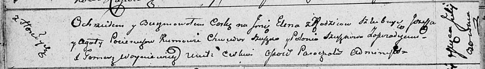

**Потеруха Сымон Иосифов (Paciarucha Symon)**

30 июня 1810 г -- крещение (НИАБ 136-13-894, лист 78, №26/1810-р
(ориг)).

**НИАБ 136-13-894:** Лист 78. **Метрическая запись №26/1810-р (ориг).**

{width="6.496527777777778in"
height="1.0345898950131234in"}

Осовская Покровская церковь. 30 июня 1810 года. Метрическая запись о
крещении.

Pacierucha Symon -- сын родителей с деревни Горелое.

Pacierucha Jozef -- отец.

Pacieruchowa Agata -- мать.

Szuszko Jakub -- кум.

Szuszkowa Połonia -- кума.

Woyniewicz Tomasz -- ксёндз.
