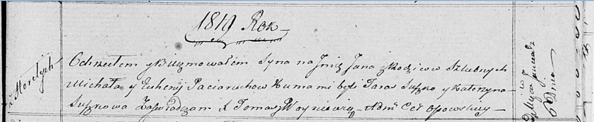

**Потеруха Настасья Михалова (Paciaruchowna Nastazyja)**

8 ноября 1813 г -- крещение (НИАБ 136-13-894, лист 87об, №35/1813-р
(ориг)).

**НИАБ 136-13-894:** Лист 87об. **Метрическая запись №35/1813-р
(ориг).**

{width="6.496527777777778in"
height="0.8072889326334208in"}

Осовская Покровская церковь. 8 ноября 1813 года. Метрическая запись о
крещении.

Paciaruchowna Nastazyja -- дочь родителей с деревни Горелое.

Paciarucha Michał -- отец.

Paciaruchowa Euhenija -- мать.

Suszko Taras -- кум.

Suszkowa Katerzyna -- кума.

Woyniewicz Tomasz -- ксёндз.
