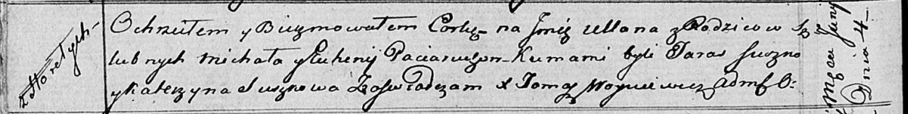

**Потеруха Ульяна Михалова (Paciaruchowna Ullana)**

4 июня 1816 г -- крещение (НИАБ 136-13-894, лист 93об, №14/1816-р
(ориг)).

**НИАБ 136-13-894:** Лист 93об. **Метрическая запись №14/1816-р
(ориг).**

Осовская Покровская церковь. 4 июня 1816 года. Метрическая запись о
крещении.

Paciaruchowna Ullana -- дочь родителей с деревни Горелое.

Paciarucha Michał -- отец.

Paciaruchowa Euhenija -- мать.

Suszko Taras -- кум.

Suszkowa Katerzyna -- кума.

Woyniewicz Tomasz -- ксёндз.
