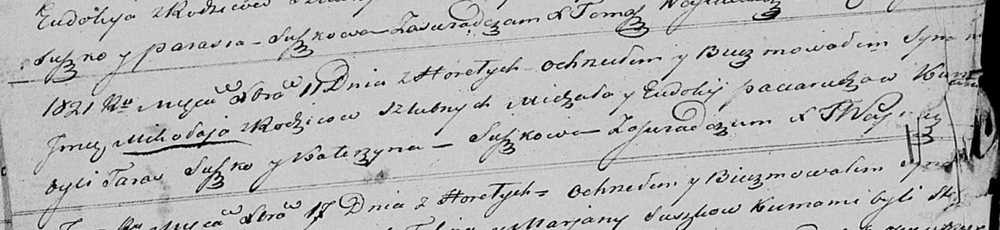

**Потеруха Миколай Михалов (Paciarucha Mikołay)**

11 декабря 1821 г -- крещение (НИАБ 136-13-894, лист 107об, №53/1821-р
(ориг)).

**НИАБ 136-13-894:** Лист 107об. **Метрическая запись №53/1821-р
(ориг).**

Осовская Покровская церковь. 11 декабря 1821 года. Метрическая запись о
крещении.

Paciarucha Mikołay -- сын родителей с деревни Горелое.

Paciarucha Michał -- отец.

Paciaruchowa Eudokija -- мать.

Suszko Taras -- кум.

Suszkowa Katerzyna -- кума.

Woyniewicz Tomasz -- ксёндз.
