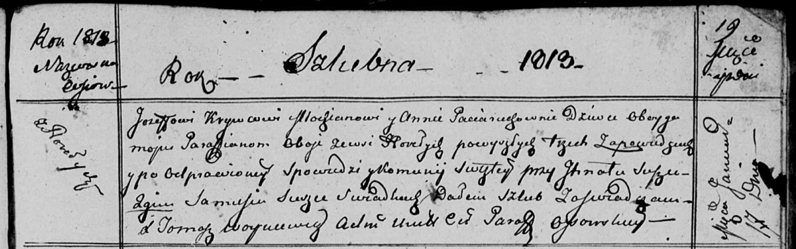

**Кривец (в девичестве Потеруха) Анна (Krywcowa Anna z Paciaruchow)**

17 января 1813 г -- венчание с молодым Иосифом Кривцом с деревни Горелое
(НИАБ 136-13-920, лист 19, №1/1813-б (ориг)).

**НИАБ 136-13-920:** Лист 19. **Метрическая запись №1/1813-б (ориг).**

Осовская Покровская я церковь. 17 января 1813 года. Запись о венчании.

Krywiec Jozef -- жених, молодой, парафии Осовской, с деревни Горелое.

Paciaruchowna Anna -- невеста, девка, парафии Осовской, с деревни
Горелое.

Suszko Jhnat -- свидетель.

Suszko Samuś -- свидетель.

Woyniewicz Tomasz -- ксёндз.
