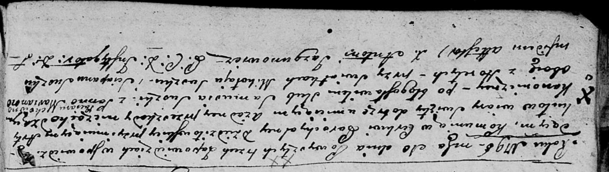

**Сушко (Потеруха) Марьяна (Suszkowa Marianna z Paciaruchow)**

10 февраля 1796 г -- венчание с Самусем Сушко с деревни Горелое (НИАБ
136-13-920, лист 2об, №3/1796-б (ориг)).

**НИАБ 136-13-920:** Лист 2об. **Метрическая запись №3/1796-б (ориг).**

Дедиловичская Покровская церковь. 10 февраля 1796 года. Метрическая
запись о венчании.

Suszko Samuś -- жених, деревня Горелое.

Paciaruchowna Marianna -- невеста, деревня Горелое.

Suszko Mikołay -- свидетель.

Suszko Sciapan -- свидетель.

Jazgunowicz Antoni -- ксёндз.
