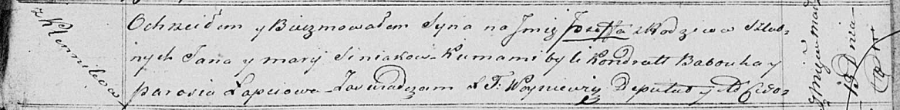

**Синяк Иосиф Янов (Siniak Jozef)**

13 марта 1821 г -- крещение (НИАБ 136-13-894, лист 106, №16/1821-р
(ориг)).

**НИАБ 136-13-894:** Лист 106. **Метрическая запись №16/1821-р (ориг).**

Осовская Покровская церковь. 13 марта 1821 года. Метрическая запись о
крещении.

Siniak Jozef -- сын родителей с деревни Клинники.

Siniak Jan -- отец.

Siniakowa Marija -- мать.

Babouko Kondrat -- кум.

Łapciowa Parasia -- кума.

Woyniewicz Tomasz -- ксёндз.
