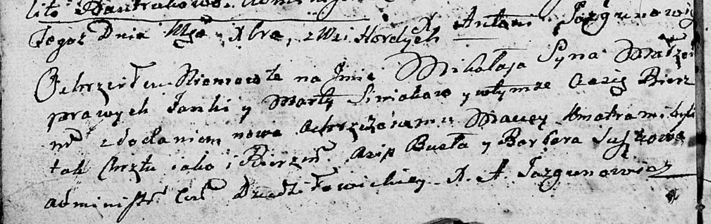

**Синяк (Кикило) Марта (Siniakowa (Kikiłowna) Marta, Martusia)**

10 ноября 1801 г -- венчание с Яном Синяком с деревни Горелое (НИАБ
136-13-920, лист 7об, №8/1801-р (ориг)).

9 декабря 1802 г -- крещение сына Миколая Мацея (НИАБ 136-13-894, лист
48об, №45/1802-р (ориг)).

**НИАБ 136-13-920:** Лист 7об. **Метрическая запись №8/1801-б (ориг).**

{width="6.496527777777778in"
height="1.801648075240595in"}

Дедиловичская Покровская церковь. 10 ноября 1801 года. Метрическая
запись о венчании.

Siniak Jan -- жених, с деревни \[Горелое\].

Kikiłowna Martusia -- невеста, с деревни Клинники.

Suszko Cimoszka -- свидетель.

Łapać Andrzey -- свидетель, с деревни Клинники.

Jazgunowicz Antoni -- ксёндз.

**НИАБ 136-13-894:** Лист 48об. **Метрическая запись №45/1802-р
(ориг).**

{width="6.496527777777778in"
height="2.058451443569554in"}

Дедиловичская Покровская церковь. \[9\] декабря 1802 года. Метрическая
запись о крещении.

Siniak Mikołay Maciey -- сын родителей с деревни Горелое.

Siniak Janka -- отец.

Siniakowa Marta -- мать.

Busła Asip -- кум.

Suszkowa Marta -- кума.

Jazgunowicz Antoni -- ксёндз.
