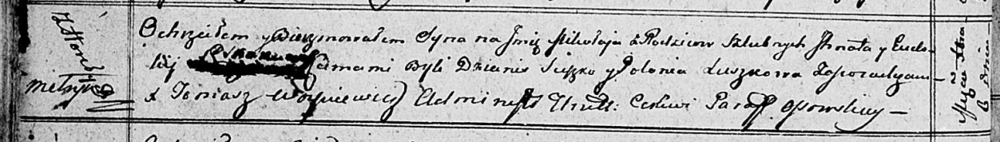

**Скакун Евдокия (Skakunowa Eudokija)**

6 декабря 1812 г -- крещение сына Миколая (НИАБ 136-13-894, лист 85об,
№55/1812-р (ориг)).

**НИАБ 136-13-894:** Лист 85об. **Метрическая запись №55/1812-р
(ориг).**

Осовская Покровская церковь. 6 декабря 1812 года. Метрическая запись о
крещении.

Skakun Mikołay -- сын родителей с деревни Горелое.

Skakun Jhnat -- отец.

Skakunowa Eudokija -- мать.

Suszko Dzianis -- кум.

Suszkowa Połonija -- кума.

Woyniewicz Tomasz -- ксёндз.
