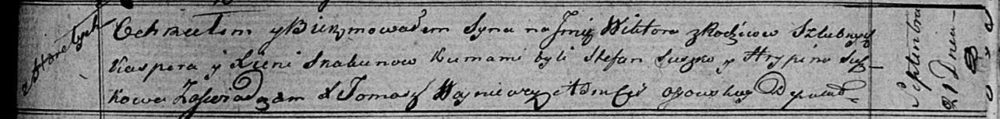

**Скакун Виктор Касперов (Skakun Wiktor)**

21 сентября 1819 г -- крещение (НИАБ 136-13-894, лист 103, №53/1819-р
(ориг)).

**НИАБ 136-13-894:** Лист 103. **Метрическая запись №53/1819-р (ориг).**

Осовская Покровская церковь. 21 сентября 1819 года. Метрическая запись о
крещении.

Skakun Wiktor -- сын родителей с деревни Горелое.

Skakun Kasper -- отец.

Skakunowa Xienia -- мать.

Suszko Stefan -- кум.

Suszkowa Hrypina -- кума.

Woyniewicz Tomasz -- ксёндз.
