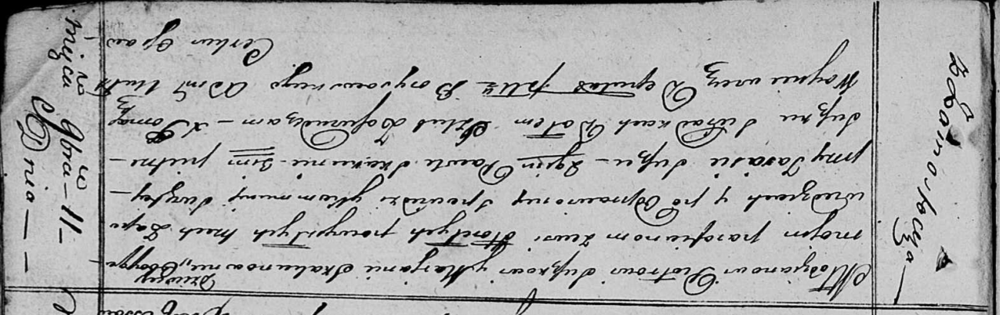

**Сушко (в девичестве Скакун) Марьяна (Suszkowa Marjana z Skakunow)**

11 ноября 1816 г -- венчание с молодым Петром Сушко с деревни Замосточье
(НИАБ 136-13-920, лист 23, №9/1816-б (ориг)).

**НИАБ 136-13-920:** Лист 23. **Метрическая запись №9/1816-б (ориг).**

{width="6.496527777777778in"
height="2.046382327209099in"}

Осовская Покровская церковь. 11 ноября 1816 года. Запись о венчании.

Suszko Piotr -- жених, молодой, парафии Осовской, с деревни Замосточье.

Skakunowna Marjana -- невеста, девка, парафии Осовской, с деревни
Горелое.

Suszko Taras -- свидетель.

Skakun Paweł -- свидетель.

Suszko Piotr -- свидетель.

Woyniewicz Tomasz -- ксёндз.
