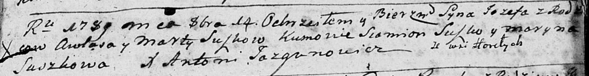
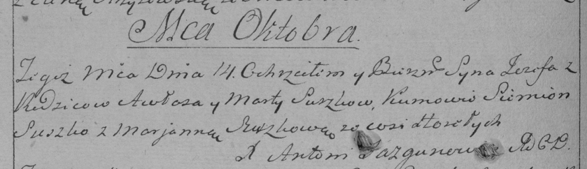

**Сушко Иосиф Авласов (Suszko Jozef)**

14 октября 1789 г -- крещение сына Иосифа (НИАБ 136-13-894, лист 8,
№53/1789-р (ориг)), (РГИА 823-2-18, лист 238об, №24/1789-р (коп)).

**НИАБ 136-13-894:** Лист 8. **Метрическая запись №53/1789-р (ориг).**

Дедиловичская Покровская церковь. 14 октября 1789 года. Метрическая
запись о крещении.

Suszko Jozef -- сын родителей с деревни Горелое.

Suszko Awłas -- отец.

Suszkowa Marta -- мать.

Suszko Siomion - кум.

Suszkowa Maryna - кума.

Jazgunowicz Antoni -- ксёндз.

**РГИА 823-2-18:** Лист 238об. **Метрическая запись №24/1789-р (коп).**

Дедиловичская Покровская церковь. 14 октября 1789 года. Метрическая
запись о крещении.

Suszko Jezef -- сын родителей с деревни Горелое.

Suszko Awłas -- отец.

Suszko Marta -- мать.

Suszko Siemion -- кум.

Suszkowa Marjanna - кума.

Jazgunowicz Antoni -- ксёндз.
