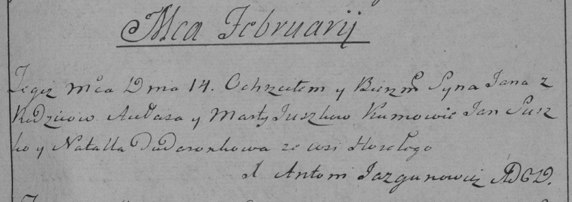

**Сушко Ян Авласов (Suszko Jan)**

14 февраля 1787 г -- крещение (НИАБ 136-13-894, лист 1, №2/1787-р (ориг)
РГИА 823-18, лист 233, №3/1787-р (коп))

**НИАБ 136-13-894:** Лист 1. **Метрическая запись №2/1787-р (ориг)**

{width="6.496527777777778in"
height="1.1660094050743657in"}

Дедиловичская Покровская церковь. \[14 февраля\] 1787 года. Метрическая
запись о крещении.

Suszko \[Jan\]- сын родителей с деревни Горелое.

Suszko \[Aułas\]? -- отец.

Suszkowa Marta -- мать.

\[Suszko Jan\] -- кум.

\[Dudaronkowa Natalla\] -- кума.

Jazgunowicz Antoniusz -- ксёндз.

**РГИА 823-2-18:** Лист 233. **Метрическая запись №3/1787-р (коп).**

{width="6.496527777777778in"
height="2.2979166666666666in"}

Дедиловичская Покровская церковь. 14 февраля 1787 года. Метрическая
запись о крещении.

Suszko Jan -- сын родителей с деревни Горелое.

Suszko Aułas -- отец.

Suszkowa Marta -- мать.

Suszko Jan -- кум.

Dudaronkowa Natalla - кума.

Jazgunowicz Antoni -- ксёндз.
