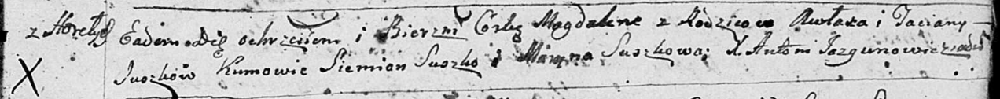

**Сушко (Ядзвинка) Татьяна (Suszkowa Taciana Jadzwinkowa)**

17 февраля 1796 г -- венчание с Авласом Сушко с деревни Горелое (НИАБ
136-13-894, лист 3, №8/1796-б (ориг)).

20 июля 1796 г -- крещение дочери Магдалены (НИАБ 136-13-894, лист 30,
№69/1796-р (ориг)).

**НИАБ 136-13-920:** Лист 3. **Метрическая запись №8/1796-б (ориг).**

{width="6.496527777777778in"
height="1.1914884076990375in"}

Дедиловичская Покровская церковь. 17 февраля 1796 года. Метрическая
запись о венчании.

Szuszko Awłas -- жених, деревня Горелое.

Jadzwinkowa Taciana -- невеста, деревня Дедиловичи.

Suszko Mikołay -- свидетель, деревня Горелое.

Suszko Sciepan -- свидетель, деревня Горелое.

Jazgunowicz Antoni -- ксёндз.

**НИАБ 136-13-894:** Лист 30. **Метрическая запись №69/1796-р (ориг).**

{width="6.496527777777778in"
height="0.6436854768153981in"}

Дедиловичская Покровская церковь. 20 июля 1796 года. Метрическая запись
о крещении.

Suszkowna Magdalena -- дочь родителей с деревни Горелое.

Suszko Awłas -- отец.

Suszkowa Taciana -- мать.

Suszko Siemion - кум.

Suszkowa Maryna - кума.

Jazgunowicz Antoni -- ксёндз.
