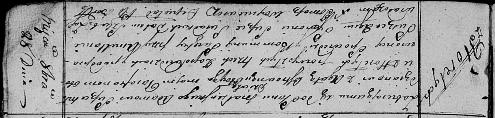

**Сушко Адам (Suszko Adam)**

28 октября 1817 г -- венчание с девкой Агатой Островской с деревни
Горелое (НИАБ 136-13-920, лист 24, №7/1817-б (ориг)).

**НИАБ 136-13-920:** Лист 24. **Метрическая запись №7/1817-б (ориг).**

{width="6.496527777777778in"
height="1.5535608048993876in"}

Осовская Покровская церковь. 28 октября 1817 года. Запись о венчании.

Suszko Adam -- жених, молодой, парафии Осовской, с деревни Горелое.

Ostrowska Agata -- невеста, девка, парафии Осовской, с деревни Горелое.

Suszko Amillan -- свидетель.

Suszko Symon -- свидетель.

Woyniewicz Tomasz -- ксёндз.
