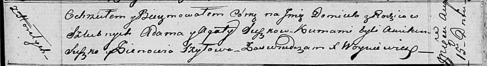

**Сушко Домицеля Адамова (Suszkowna Domicela)**

15 августа 1816 г -- крещение (НИАБ 136-13-894, лист 94, №22/1816-р
(ориг)).

**НИАБ 136-13-894:** Лист 94. **Метрическая запись №22/1816-р (ориг).**

Осовская Покровская церковь. 15 августа 1816 года. Метрическая запись о
крещении.

Suszkowna Domicela -- дочь родителей с деревни Горелое.

Suszko Adam -- отец.

Suszkowa Agata -- мать.

Suszko Amilan -- кум.

Szyłowa Zienowia -- кума.

Woyniewicz Tomasz -- ксёндз.
