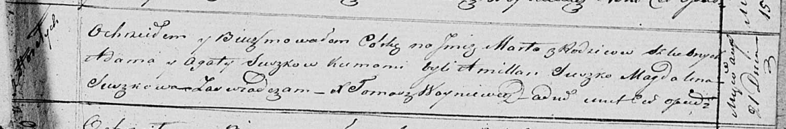

**Сушко Марта Адамова (Suszkowna Marta)**

21 августа 1821 г -- крещение (НИАБ 136-13-894, лист 107, №39/1821-р
(ориг)).

**НИАБ 136-13-894:** Лист 107. **Метрическая запись №39/1821-р (ориг).**

Осовская Покровская церковь. 21 августа 1821 года. Метрическая запись о
крещении.

Suszkowna Marta -- дочь родителей с деревни Горелое.

Suszko Adam -- отец.

Suszkowa Agata -- мать.

Suszko Amillan -- кум.

Suszkowa Magdalena -- кума.

Woyniewicz Tomasz -- ксёндз.
