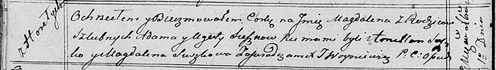

**Сушко Салезий Адамов (Suszko Salezyasz)**

5 февраля 1811 г -- крещение (НИАБ 136-13-894, лист 80, №8/1811-р
(ориг)).

**НИАБ 136-13-894:** Лист 80. **Метрическая запись №8/1811-р (ориг).**

{width="6.496527777777778in"
height="0.8676345144356955in"}

Осовская Покровская церковь. 5 февраля 1811 года. Метрическая запись о
крещении.

Szuszko Salezyasz -- сын родителей с деревни Горелое.

Suszko Adam -- отец.

Suszkowa Agata -- мать.

Szuszko Amillan -- кум.

Szyłakowa Zienowia -- кума.

Woyniewicz Tomasz -- ксёндз.
