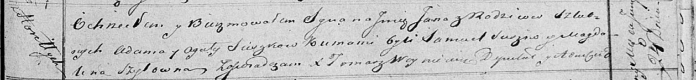

**Сушко Ян Адамов (Suszko Jan)**

24 июня 1819 г -- крещение (НИАБ 136-13-894, лист 101, №32/1819-р
(ориг)).

Лист 101. **Метрическая запись №32/1819-р (ориг).**

{width="6.496527777777778in"
height="0.75834208223972in"}

Осовская Покровская церковь. 24 июня 1819 года. Метрическая запись о
крещении.

Suszko Jan -- сын родителей с деревни Горелое.

Suszko Adam -- отец.

Suszkowa Agata -- мать.

Suszko Samuel -- кум.

Szyłowna Magdalena -- кума.

Woyniewicz Tomasz -- ксёндз.
