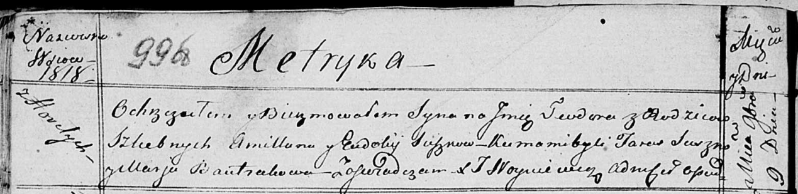

**Сушко Тодор Амильянов (Suszko Teodor)**

9 ноября 1818 г -- крещение (НИАБ 136-13-894, лист 99об, №37/1818-р
(ориг)).

**НИАБ 136-13-894:** Лист 99об. **Метрическая запись №37/1818-р
(ориг).**

Осовская Покровская церковь. 9 ноября 1818 года. Метрическая запись о
крещении.

Suszko Teodor -- сын родителей с деревни Горелое.

Suszko Amillan -- отец.

Suszkowa Eudokija -- мать.

Suszko Taras -- кум.

Bautrukowa Marja -- кума.

Woyniewicz Tomasz -- ксёндз.
