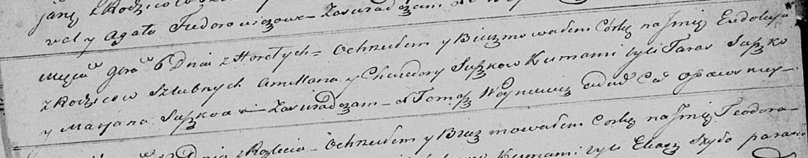

**Сушко Амильян (Suszko Amillan)**

6 ноября 1821 г -- крещение дочери Евдокии (НИАБ 136-13-894, лист 107об,
№50/1821-р (ориг)).

**НИАБ 136-13-894:** Лист 107об. **Метрическая запись №50/1821-р
(ориг).**

{width="6.496527777777778in"
height="1.2753018372703413in"}

Осовская Покровская церковь. 6 ноября 1821 года. Метрическая запись о
крещении.

Suszkowna Eudokija -- дочь родителей с деревни Горелое.

Suszko Amillan -- отец.

Suszkowa Chwiedora -- мать.

Suszko Taras -- кум.

Suszkowa Marjana -- кума.

Woyniewicz Tomasz -- ксёндз.
