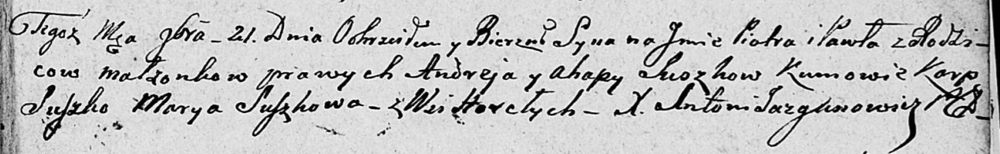

**Сушко Пётр Андреев (Suszko Piotr Paweł)**

21 ноября 1808 г -- крещение (НИАБ 136-13-894, лист 73, №44/1808-р
(ориг)).

**НИАБ 136-13-894:** Лист 73. **Метрическая запись №44/1808-р (ориг).**

Дедиловичская Покровская церковь. 21 ноября 1808 года. Метрическая
запись о крещении.

Suszko Piotr Paweł -- сын родителей с деревни Горелое.

Suszko Andrey -- отец.

Suszkowa Ahapa -- мать.

Suszko Karp -- кум.

Suszkowa Marya -- кума.

Jazgunowicz Antoni -- ксёндз.
