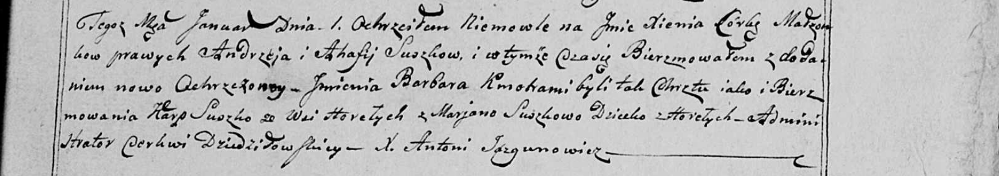

**Сушко Ксеня Андреева (Suszkowna Xienia Barbara)**

1 января 1800 г -- крещение (НИАБ 136-13-949, лист 101, №2/1800-р
(коп)).

**НИАБ 136-13-949:** Лист 101. **Метрическая запись №2/1800-р (коп).**

(См. тж.: РГИА 823-2-18, лист 274, №2/1800-р (коп), НИАБ 136-13-894,
лист 40, №2/1800-р (ориг))

{width="6.496527777777778in"
height="1.148611111111111in"}

Дедиловичская Покровская церковь. 1 января 1800 года. Метрическая запись
о крещении.

Suszkowna Xienia Barbara -- дочь родителей с деревни Горелое.

Suszko Andrzey -- отец.

Suszkowa Ahafija \[Anna\] -- мать.

Suszko Karp -- кум, с деревни Горелое.

Suszkowa Marjana - кума.

Jazgunowicz Antoni -- ксёндз.
