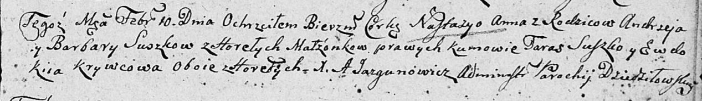

**Сушко Андрей (Suszko Andrzey)**

22 октября 1805 г -- крещение сына Павла Стефана (НИАБ 136-13-894, лист
58, №48/1805-р (ориг)).

10 февраля 1807 г -- крещение дочери Настасьи Анны (НИАБ 136-13-894,
лист 62, №9/1807-р (ориг)).

**НИАБ 136-13-894:** Лист 58. **Метрическая запись №48/1805-р (ориг).**

{width="6.496527777777778in"
height="0.8696456692913386in"}

Дедиловичская Покровская церковь. 22 октября 1805 года. Метрическая
запись о крещении.

Suszko Paweł Stefan -- сын родителей с деревни Горелое.

Suszko Andrzey -- отец.

Suszkowa Barbara -- мать.

Suszko Taras -- кум.

Babikowa Ewdokija -- кума.

Jazgunowicz Antoni -- ксёндз.

**НИАБ 136-13-894:** Лист 62. **Метрическая запись №9/1807-р (ориг).**

{width="6.496527777777778in"
height="0.9434011373578303in"}

Дедиловичская Покровская церковь. 10 февраля 1807 года. Метрическая
запись о крещении.

Suszkowna Nastazya Anna -- дочь родителей с деревни Горелое.

Suszko Andrzey -- отец.

Suszkowa Barbara -- мать.

Suszko Taras -- кум, с деревни Горелое.

Krywcowa Ewdokija -- кума, с деревни Горелое.

Jazgunowicz Antoni -- ксёндз.
