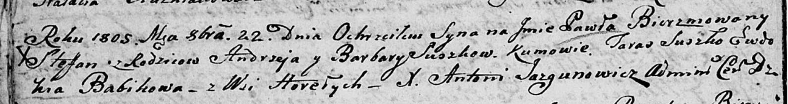

**Сушко Настасья Андреева (Suszkowna Nastazya Anna)**

10 февраля 1807 г -- крещение (НИАБ 136-13-894, лист 62, №9/1807-р
(ориг)).

**НИАБ 136-13-894:** Лист 62. **Метрическая запись №9/1807-р (ориг).**

{width="6.496527777777778in"
height="0.9434011373578303in"}

Дедиловичская Покровская церковь. 10 февраля 1807 года. Метрическая
запись о крещении.

Suszkowna Nastazya Anna -- дочь родителей с деревни Горелое.

Suszko Andrzey -- отец.

Suszkowa Barbara -- мать.

Suszko Taras -- кум, с деревни Горелое.

Krywcowa Ewdokija -- кума, с деревни Горелое.

Jazgunowicz Antoni -- ксёндз.
