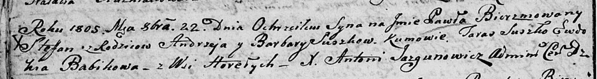

**Сушко Павел Андреев (Suszko Paweł Stefan)**

22 октября 1805 г -- крещение (НИАБ 136-13-894, лист 58, №48/1805-р
(ориг)).

**НИАБ 136-13-894:** Лист 58. **Метрическая запись №48/1805-р (ориг).**

Дедиловичская Покровская церковь. 22 октября 1805 года. Метрическая
запись о крещении.

Suszko Paweł Stefan -- сын родителей с деревни Горелое.

Suszko Andrzey -- отец.

Suszkowa Barbara -- мать.

Suszko Taras -- кум.

Babikowa Ewdokija -- кума.

Jazgunowicz Antoni -- ксёндз.
