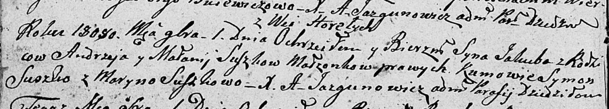

**Сушко Якуб Андреев (Suszko Jakub)**

1 ноября 1808 г -- крещение (НИАБ 136-13-894, лист 72об, №40/1808-р
(ориг)).

**НИАБ 136-13-894:** Лист 72об. **Метрическая запись №40/1808-р
(ориг).**

{width="6.496527777777778in"
height="1.1639971566054244in"}

Дедиловичская Покровская церковь. 1 ноября 1808 года. Метрическая запись
о крещении.

Suszko Jakub -- сын родителей с деревни Горелое.

Suszko Andrzey -- отец.

Suszkowa Małanija -- мать.

Suszko Symon -- кум.

Suszkowa Maryna -- кума.

Jazgunowicz Antoni -- ксёндз.
