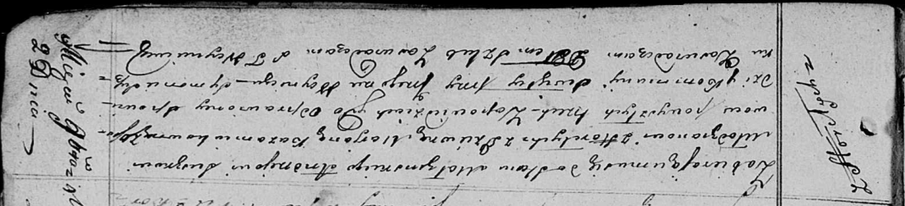

**Сушко Андрей (Suszko Andrzey)**

2 ноября 1819 г -- венчание с девкой Марьяной Кожемяко с деревни Осово
(НИАБ 136-13-920, лист 26, №7/1819-б (ориг)).

**НИАБ 136-13-894:** Лист 26. **Метрическая запись №7/1819-б (ориг).**

Осовская Покровская церковь. 2 ноября 1819 года. Запись о венчании.

Suszko Andrzey -- жених, молодой, парафии Осовской, с деревни Горелое.

Każamiakowna Marjana -- невеста, девка, парафии Осовской, с деревни
Осово.

Woynicz Grzegorz -- свидетель.

Suszko Symon -- свидетель.

Woyniewicz Tomasz -- ксёндз.
