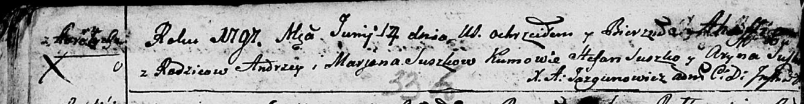
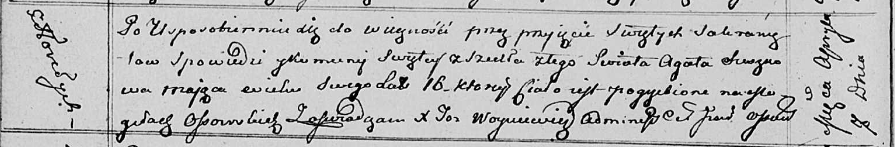

**Сушко Агафия Андреева (Suszkowa Ahaffia)**

17 июня 1797 г -- крещение (НИАБ 136-13-894, лист 33об, №36/1797-р
(ориг)).

7 апреля 1813 г -- отпевание, умерла в возрасте 16 лет (НИАБ 136-13-919,
лист 26об, №33/1813-у (ориг)).

**НИАБ 136-13-894:** Лист 33об. **Метрическая запись №36/1797-р
(ориг).**

Дедиловичская Покровская церковь. 17 июня 1797 года. Метрическая запись
о крещении.

Suszkowna Ahaffia -- дочь родителей с деревни Горелое.

Suszko Andrzey -- отец.

Suszko Marjana -- мать.

Suszko Stefan - кум.

Suszkowa Aryna - кума.

Jazgunowicz Antoni -- ксёндз.

**НИАБ 136-13-919:** Лист 26об. **Метрическая запись №33/1813-у
(ориг).**

Осовская униатская церковь. 7 апреля 1813 года. Метрическая запись об
отпевании.

Suszkowa Agata -- умершая, 16 лет, с деревни Горелое, похоронена на
кладбище деревни Осово.

Woyniewicz Tomasz -- ксёндз.
