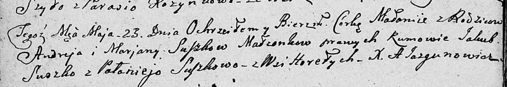

**Сушко Маланья Андреева (Suszkowna Małanija)**

23 мая 1809 г -- крещение (НИАБ 136-13-894, лист 74об, №25/1809-р
(ориг)).

**НИАБ 136-13-894:** Лист 74об. **Метрическая запись №25/1809-р
(ориг).**

{width="6.496527777777778in"
height="1.117732939632546in"}

Дедиловичская Покровская церковь. 23 мая 1809 года. Метрическая запись о
крещении.

Suszkowna Małanija -- дочь родителей с деревни Горелое.

Suszko Andrey -- отец.

Suszkowa Marjana -- мать.

Suszko Jakub -- кум.

Suszkowa Palanieja -- кума.

Jazgunowicz Antoni -- ксёндз.
