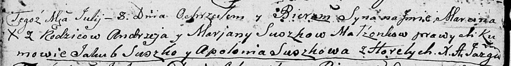

**Сушко Марцин Андреев (Suszko Marcin)**

8 июля 1806 г -- крещение (НИАБ 136-13-894, лист 60об, №28/1806-р
(ориг)).

**НИАБ 136-13-894:** Лист 60об. **Метрическая запись №28/1806-р
(ориг).**

Дедиловичская Покровская церковь. 8 июля 1806 года. Метрическая запись о
крещении.

Suszko Marcin -- сын родителей с деревни Горелое.

Suszko Andrzey -- отец.

Suszkowa Marjana -- мать.

Suszko Jakub -- кум.

Suszkowa Apołłonia -- кума.

Jazgunowicz Antoni -- ксёндз.
