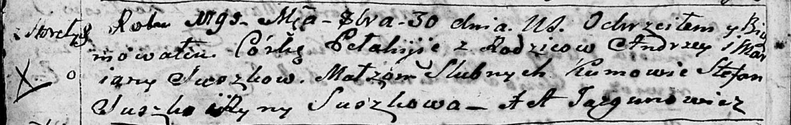
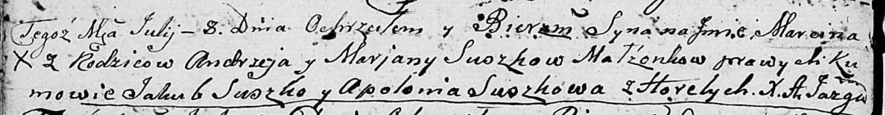
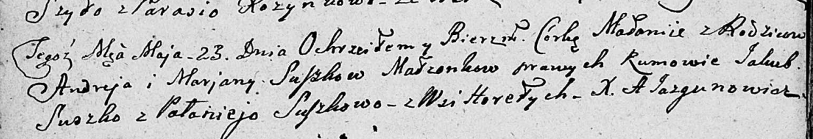

**Сушко Марьяна (Suszkowa Marjana)**

30 октября 1795 г -- крещение дочери Пелагии (НИАБ 136-13-894, лист
25об, №40/1795-р (ориг)).

17 июня 1797 г -- крещение дочери Агафии (НИАБ 136-13-894, лист 33об,
№36/1797-р (ориг)).

30 мая 1803 г -- крещение сына Яна Игнация (НИАБ 136-13-894, лист 50об,
№23/1803-р (ориг)).

8 июля 1806 г -- крещение сына Марцина (НИАБ 136-13-894, лист 60об,
№28/1806-р (ориг)).

9 марта 1807 г -- возможно, крестная мать Магдалены Барбары, дочери
Сушков Грыгоря и Катерыны с деревни Горелое (НИАБ 136-13-894, лист 62,
№14/1807-р (ориг)).

23 мая 1809 г -- крещение дочери Маланьи (НИАБ 136-13-894, лист 74об,
№25/1809-р (ориг)).

29 января 1821 г -- крещение сына Юрия (НИАБ 136-13-894, лист 105об,
№2/1821-р (ориг)).

**НИАБ 136-13-894:** Лист 25об. **Метрическая запись №40/1795-р
(ориг).**

Дедиловичская Покровская церковь. 30 октября 1795 года. Метрическая
запись о крещении.

Suszkowna Pełahija -- дочь родителей с деревни Горелое.

Suszko Andrzey -- отец.

Suszkowa Marjana -- мать.

Suszko Stefan - кум.

Suszkowa Ryna - кума.

Jazgunowicz Antoni -- ксёндз.

Лист 33об. **Метрическая запись №36/1797-р (ориг).**

Дедиловичская Покровская церковь. 17 июня 1797 года. Метрическая запись
о крещении.

Suszkowna Ahaffia -- дочь родителей с деревни Горелое.

Suszko Andrzey -- отец.

Suszko Marjana -- мать.

Suszko Stefan - кум.

Suszkowa Aryna - кума.

Jazgunowicz Antoni -- ксёндз.

**НИАБ 136-13-894:** Лист 50об. **Метрическая запись №23/1803-р
(ориг).**

Дедиловичская Покровская церковь. 30 мая 1803 года. Метрическая запись о
крещении.

Suszko Jan Jgnacy -- сын родителей с деревни Горелое.

Suszko Andrzey -- отец.

Suszkowa Marjana -- мать.

Suszko Jakub -- кум, с деревни Горелое.

Suszkowa Pałanieja -- кума, с деревни Горелое.

Jazgunowicz Antoni -- ксёндз.

**НИАБ 136-13-894:** Лист 60об. **Метрическая запись №28/1806-р
(ориг).**

Дедиловичская Покровская церковь. 8 июля 1806 года. Метрическая запись о
крещении.

Suszko Marcin -- сын родителей с деревни Горелое.

Suszko Andrzey -- отец.

Suszkowa Marjana -- мать.

Suszko Jakub -- кум.

Suszkowa Apołłonia -- кума.

Jazgunowicz Antoni -- ксёндз.

**НИАБ 136-13-894:** Лист 62. **Метрическая запись №14/1807-р (ориг).**

Дедиловичская Покровская церковь. 9 марта 1807 года. Метрическая запись
о крещении.

Suszkowna Magdalena Barbara -- дочь родителей с деревни Горелое.

Suszko Hryszka -- отец.

Suszkowa Katerzyna -- мать.

Suszko Stefan -- кум, с деревни Разлитье.

Suszkowa Marya -- кума, с деревни Горелое.

Jazgunowicz Antoni -- ксёндз.

**НИАБ 136-13-894:** Лист 74об. **Метрическая запись №25/1809-р
(ориг).**

Дедиловичская Покровская церковь. 23 мая 1809 года. Метрическая запись о
крещении.

Suszkowna Małanija -- дочь родителей с деревни Горелое.

Suszko Andrey -- отец.

Suszkowa Marjana -- мать.

Suszko Jakub -- кум.

Suszkowa Palanieja -- кума.

Jazgunowicz Antoni -- ксёндз.

**НИАБ 136-13-894:** Лист 105об. **Метрическая запись №2/1821-р
(ориг).**

Осовская Покровская церковь. 29 января 1821 года. Метрическая запись о
крещении.

Suszko Jerzy -- сын родителей с деревни Горелое.

Suszko Andrzey -- отец.

Suszkowa Marjana -- мать.

Busło Piotr -- кум.

Suszkowa Magdalena -- кума.

Woyniewicz Tomasz -- ксёндз.
